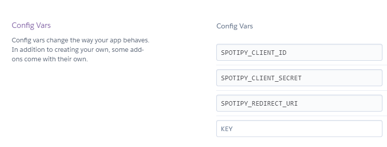

# SpotiML

A pet project, playing around with spotify API features and ML. 

A demo app can be found here: https://spotiml.herokuapp.com/


# Creating Spotify App
You will neeed a Spotify App in order to send requests to the Spotify API. To create your App, go here: https://developer.spotify.com/dashboard/applications

After creating your Spotify App, add your local host or domain to the redirect URL: e.g. `http://127.0.0.1:5000`. 

# Running locally
1. Open terminal and `cd` into root of directory 
2. Run `flask run` or `python app.py` to run the app 
3. Set config vars
    Windows: 
    ```
    SET SPOTIPY_CLIENT_ID=xxxxxxxxxx
    SET SPOTIPY_CLIENT_SECRET=xxxxxxxxxx
    SET SPOTIPY_REDIRECT_URI=http://127.0.0.1:5000
    ```

    Linux/Mac:
    ```
    export SPOTIPY_CLIENT_ID=xxxxxxxxxx
    export SPOTIPY_CLIENT_SECRET=xxxxxxxxxx
    export SPOTIPY_REDIRECT_URI=http://127.0.0.1:5000
    ```

# Deploying 

1. Freeze pip / conda requirements 
    ```
    python -m pip list --format=freeze > requirements.txt
    ```

2. Update `Procfile` to use gunicorn to run the web server and set app.py as the application to run: 
    ```
    web: gunicorn app:app
    ```

3. Set config vars in Heroku `Settings` > `Config vars`

    


4. Connect app via GitHub and then press `Deploy`

    